# Bandgap Voltage Reference (BGR) 

A Bandgap Reference (BGR) circuit designed to provide a highly stable, temperature-independent, and supply-voltage-independent reference voltage. The design combines Proportional-to-Absolute-Temperature (PTAT) and Complementary-to-Absolute-Temperature (CTAT) voltage components to achieve a near-zero temperature coefficient. It features an integrated start-up circuit to eliminate degenerate zero-current states.

## Core Applications
* **Power Management:** Low-Dropout Regulators (LDOs) and Buck/Boost Converters.
* **Data Converters:** Reference voltage for Analog-to-Digital Converters (ADCs) and Digital-to-Analog Converters (DACs).

---

## 1. Core Engineering Issues & Solutions

During the design and simulation of a standard BGR circuit, three major practical challenges must be resolved to achieve industry-grade reliability:

| Engineering Issue Identified | Practical Impact on Circuit | Implemented Architectural Solution |
| :--- | :--- | :--- |
| **Supply Voltage Variation** | Changes in $V_{DD}$ modulate the bias current, corrupting the reference output. | **Active Current Mirror Load:** Replaced resistive or independent current sources with a self-biased current mirror loop to force identical branch currents ($I_0$). |
| **Temperature-Dependent Diode Current** | The initial assumption that diode current ($I'$) is constant over temperature is false; the loop forces a PTAT current ($I_{PTAT}$) through the CTAT element. | **Mathematical Validation & Calibration:** Simulation and DC analysis confirm that even with a PTAT current injection, the voltage across the diode maintains a stable CTAT profile ($\approx -1.79\text{ mV/K}$). |
| **Degenerate "Zero-Current" State** | Being a self-biased loop, the circuit has a valid equilibrium state where all currents are exactly zero. | **Auxiliary Start-Up Circuit:** Added an active monitoring branch ($N_1, N_2, R$) that injects current only when the circuit fails to start. |

---

## 2. Block-by-Block Circuit Architecture & Verification

### A. CTAT (Complementary-to-Absolute-Temperature) Generation
A forward-biased $PN$ junction (diode-connected BJT) exhibits a negative temperature coefficient. The voltage across the diode is given by $V_D = V_T \ln(I_0 / I_S)$. The exponential temperature dependency of the saturation current $I_S$ dominates, yielding a negative slope ($\approx -1.6\text{ mV/}^\circ\text{C}$ to $-1.88\text{ mV/K}$).

#### CTAT Circuit Schematic
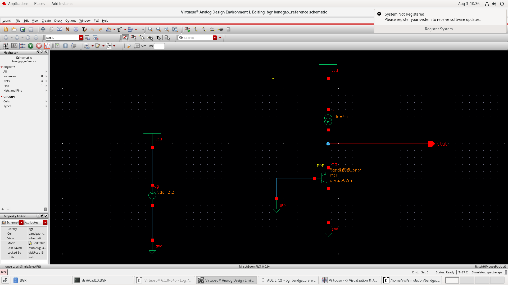

#### CTAT Simulation Waveform
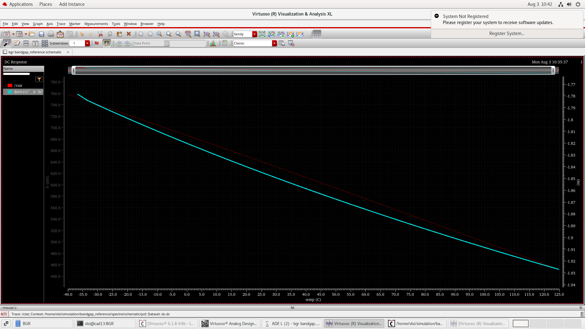

---

### B. PTAT (Proportional-to-Absolute-Temperature) Generation
By operating two diodes at different current densities (using a scaling area factor $N = 2$), the difference between their base-emitter voltages ($\Delta V_{BE}$) is extracted across resistor $R_1$. This produces a voltage directly proportional to absolute temperature with a positive slope ($\approx +86.25\ \mu\text{V/K}$).

#### PTAT Circuit Schematic
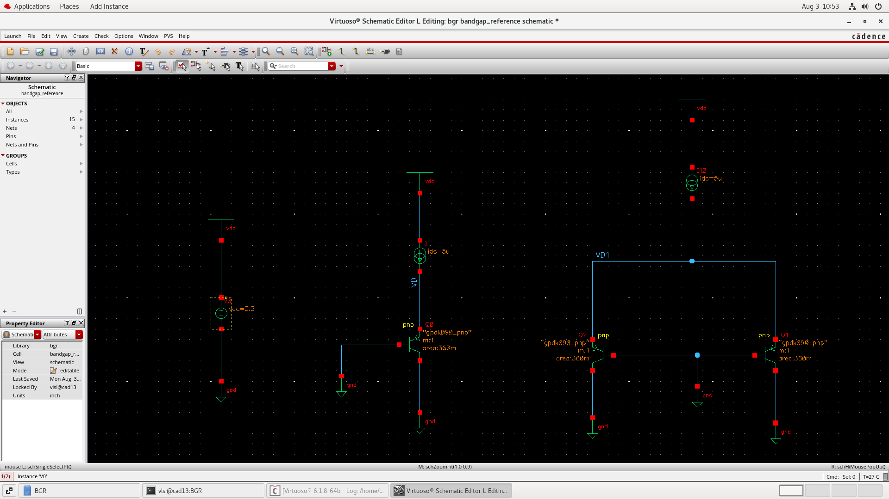

#### PTAT Simulation Waveform
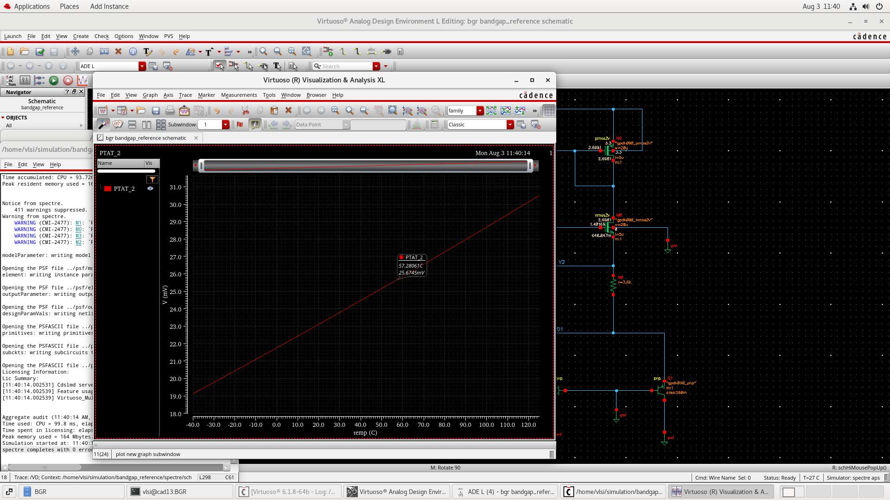

---

### C. Complete Combined BGR Circuit
The BGR architecture references a self-biased current mirror loop to cross-inject the PTAT and CTAT voltage components into a single output node. 

#### Complete BGR Circuit Schematic
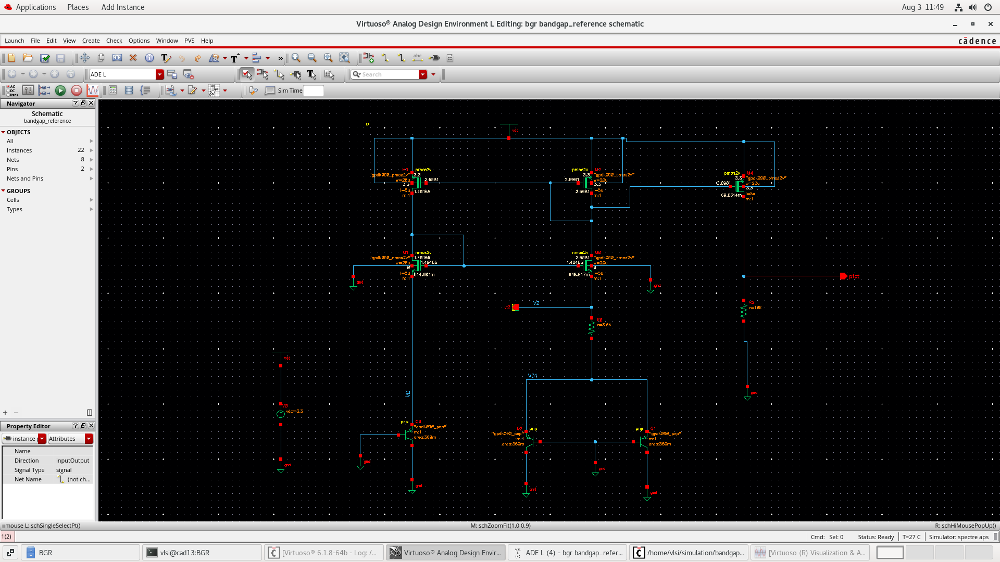

---

## 3. Mathematical Calculations: Theory vs. Cadence Simulation

### 1. Theoretical Synthesis (Hand Calculations)
The target output voltage requires summing scaled versions of the PTAT and CTAT slopes to yield a net zero derivative ($\frac{dV_{\text{ref}}}{dT} = 0$):

$$V_{\text{ref}} = \alpha_1 V_{\text{PTAT}} + \alpha_2 V_{\text{CTAT}}$$

* **Temperature Range:** $-40^\circ\text{C}$ to $+125^\circ\text{C}$
* **Core Loop Parameters:** Target Current $I_0 = 5\ \mu\text{A}$, Diode Scaling Factor $N = 2$.
* **Theoretical Slopes:** $\text{Slope}_{\text{PTAT}} = +86.25\ \mu\text{V/K}$, $\text{Slope}_{\text{CTAT}} = -1.6\text{ mV/}^\circ\text{C}$

Assuming $\alpha_2 = 1$ to normalize the calculation:
$$\alpha_1 (86.25\ \mu\text{V/K}) - 1.6\text{ mV/}^\circ\text{C} = 0 \implies \alpha_1 \approx 18.82$$

#### Core Component Derivations:
* **Primary Loop Resistor ($R_1$):**
  $$R_1 = \frac{V_T \ln(N)}{I_0} = \frac{26\text{ mV} \cdot \ln(2)}{5\ \mu\text{A}} = 3.6\ \text{k}\Omega$$

* **Theoretical Scaling Resistor ($R_2$):**
  $$\alpha_1 = \frac{R_2}{R_1} \ln(N) \implies 18.82 = \frac{R_2}{3.6\ \text{k}\Omega} \ln(2) \implies R_2 = 97.74\ \text{k}\Omega \approx \mathbf{97.5\ \text{k}\Omega}$$

* **Ideal Target Output Voltage ($V_{\text{ref}}$):**
  $$V_{\text{ref}} = 18.82 \cdot V_T + V_D = 18.82(26\text{ mV}) + 0.7\text{V} \approx \mathbf{1.189\text{V}}$$

---

### R2 Parametric Sweep: Individual Simulation Waveforms

To observe the effect of the temperature compensation tuning parameter ($\alpha_1$), the value of resistor $R_2$ was simulated across four distinct operating zones:

#### 1. R2 = 3.6 kΩ (Extremely Under-compensated)
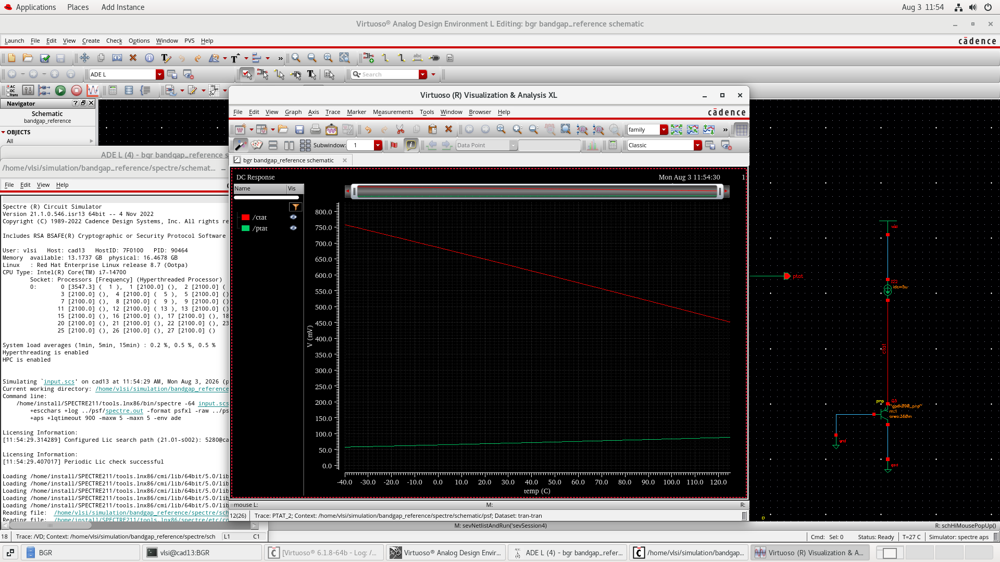
* **Behavior:** The PTAT branch gain is too low to counter the diode's temperature dependence.
* **Result:** The output tracks a native CTAT profile, falling sharply as temperature increases.

#### 2. R2 = 50 kΩ (Partially Under-compensated)
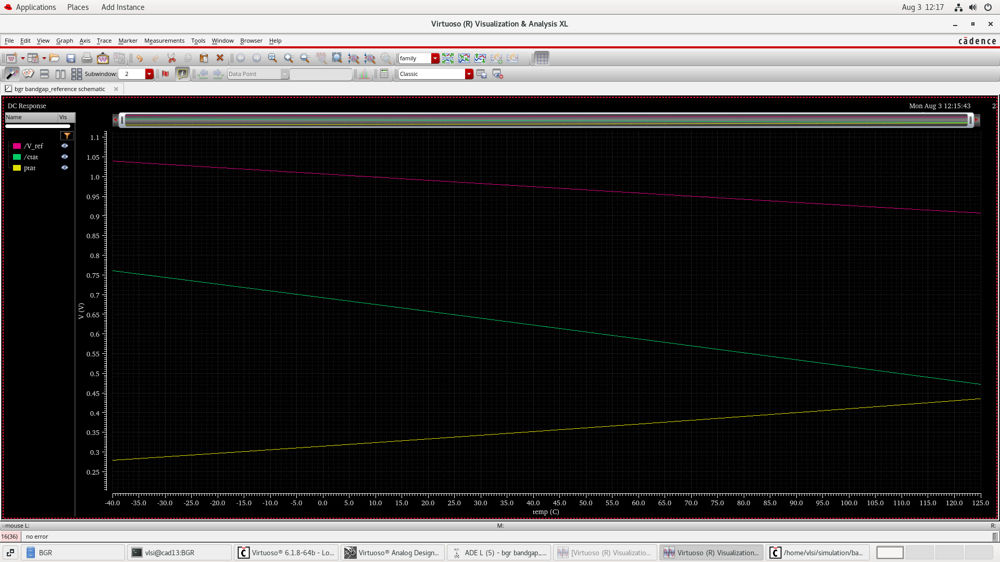
* **Behavior:** The PTAT voltage contribution is increased but remains insufficient.
* **Result:** The temperature coefficient improves slightly but stays negative, causing $V_{\text{ref}}$ to drop steadily across the sweep.

#### 3. R2 = 97.5 kΩ (Optimized Target / Theoretical Match)
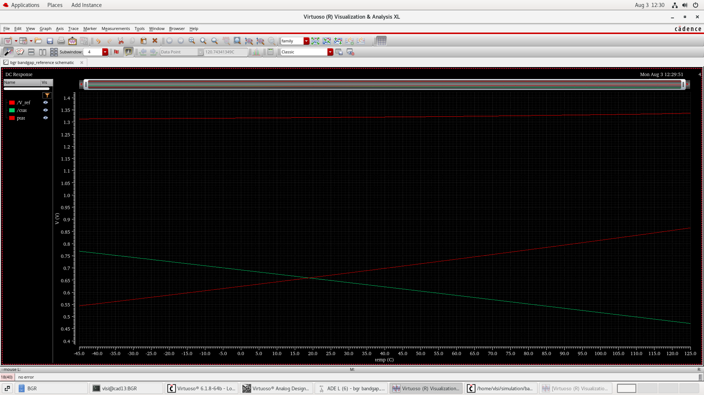
* **Behavior:** Ideal balancing point matching the theoretical design requirements ($\alpha_1 \approx 18.82$).
* **Result:** The PTAT and CTAT derivatives cancel perfectly ($\frac{dV_{\text{ref}}}{dT} = 0$), maintaining a stable output between $1.18\text{V}$ and $1.22\text{V}$.

#### 4. R2 = 120 kΩ (Highly Over-compensated)
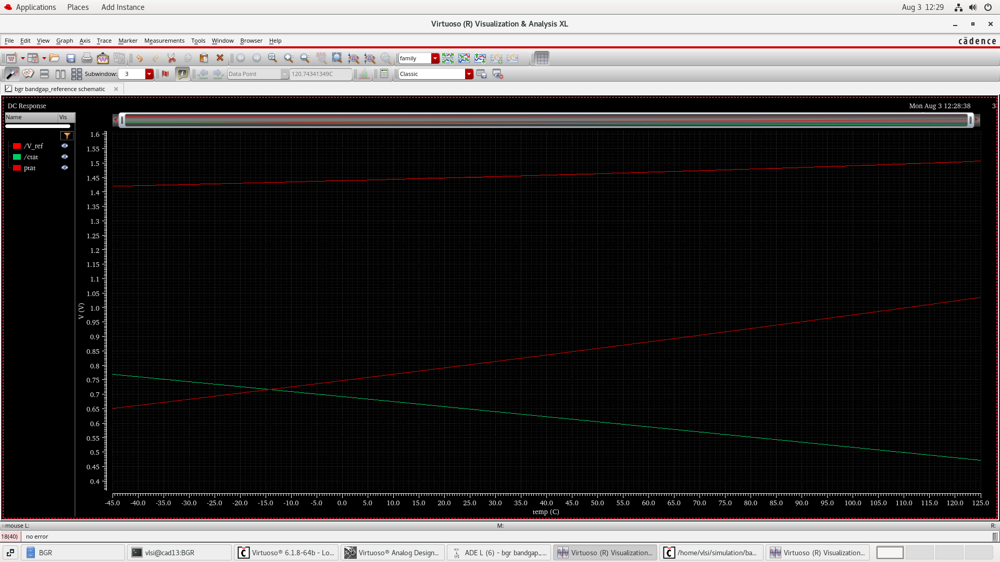
* **Behavior:** The PTAT branch gain dominates the core loop composition completely.
* **Result:** The reference voltage scales aggressively upward with temperature, yielding an uncompensated positive temperature coefficient.

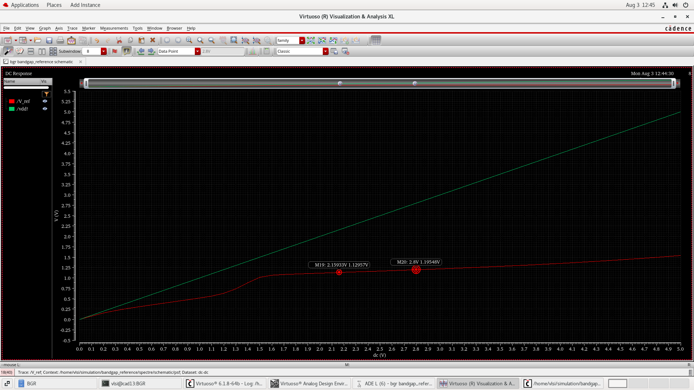

---

## 4. Deep-Dive: Start-Up Circuit Operation

To eliminate the degenerate zero-current state inherent to self-biased reference loops, an active start-up network is integrated into the core architecture. This block monitors the internal bias voltages and injects initialization current during power-on sequences.

#### A. Start-Up Circuit Schematic
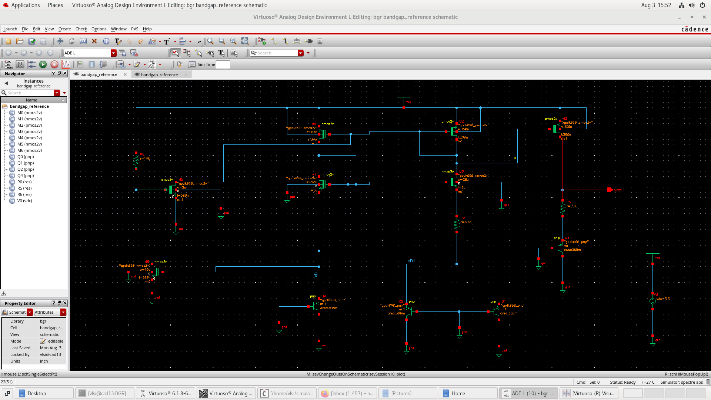

#### B. Start-Up Transient Verification Waveform
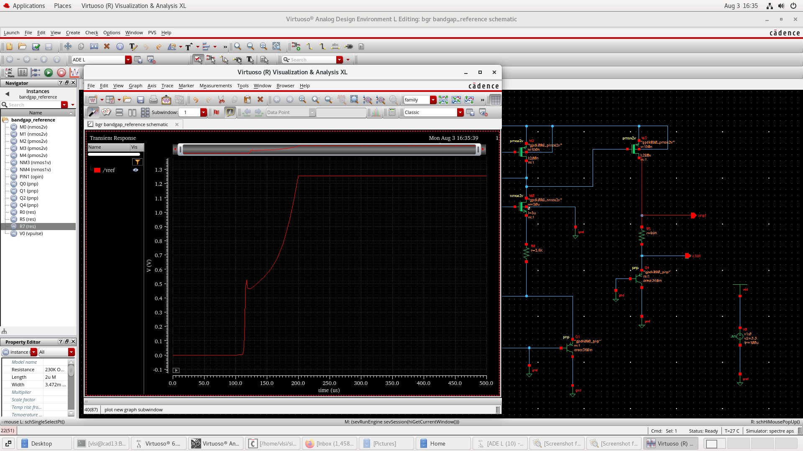

Because the BGR relies on its own generated current to bias its transistors, if the circuit boots up with zero current flowing through the PMOS and NMOS branches, the gate voltages will sit at the supply rails ($V_{DD}$ or $GND$). At these points, both mirrors remain completely turned OFF. The circuit will latch into this state permanently unless forced out.

